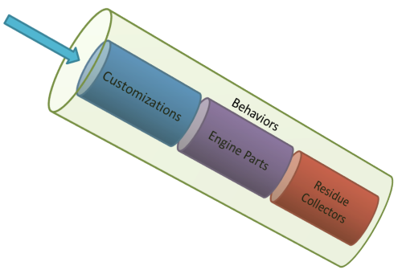

name: afx-header
layout: true

# AutoFixture

---
template: afx-header

*"Write maintainable unit tests, faster"*

**AutoFixture makes it easier for developers to do Test-Driven Development by automating non-relevant Test Fixture Setup**, allowing the Test Developer to focus on the essentials of each test case.

---
template: afx-header

## Internal architecture

### Fixture high-level layout

* The fixture class **is a specialization of IFixture**.
* **Contains a set of specimen builders** called engine parts.
* Engine Parts contain logic to instantiate
	* Well known **primitive types**.
	* **Complex types**, via reflection.
* Residue collectors satisfy requests that a Fixture cannot resolve.  

.autofixtureimage[]

---
template: afx-header

## Customizations

* By default, Customizations collection is empty.
* Customize the fixture by adding ISpecimenBuilder instances.
* Specimen Builders intercept the default engine parts.
* Allows the customization to get a shot at each request before them.

Basic usage:
```csharp
// By convention, all fields that end with "Email"
// will have its value set to "foo@mail.com"
public class EmailConventionCustomization : ICustomization {
	public void Customize(IFixture fixture){
		fixture.Customizations.Add(new EmailConventionCustomizationSpecimenBuilder())
	}
} 
// apply EmailConventionCustomization
fixture.Customize(new EmailConventionCustomization());
```

---
template: afx-header

## Specimen Builders

* Handles a request for a specified specimen.
* Are used in conjuntion with customizations to define **conventions**.
* A chain of resposability pattern.

```chsarp
public class EmailConventionCustomizationSpecimenBuilder() : ISpecimenBuilder{
	public object Create(object request, ISpecimenContext context){
		var pi = object as PropertyInfo;

		if (pi == null) 
			return new NoSpecimen(request);
		
		if (pi.MemberName.EndsWith("Email"))
			return "foo@mail.com";
	}
}
```

---

## Creating instances

### Create Single

```csharp
var autoStr = fixture.Create<string>(); //returns "f5cdf6b1-a473-410f-95f3-f427f7abb0c7"
var autoStr2 = fixture.Create<string>("lucky"); //returns "lucky6b1-a473-410f-95f3-f427f7abb0c7"
var autoGeneratedClass = fixture.Create<ComplexParent>();
```

### Create Many

```csharp
var strings = fixture.CreateMany<string>();
var myInstances = fixture.CreateMany<MyClass>();
```

---
template: afx-header

## Building/Customizing Types

* Single time customization

```csharp
var i = fixture.Create<MyItem>();
var m = fixture.Build<MyClass>()
    .With(x => x.MyText, "lucky") //Customize property
	.Do(x => x.Items.Add(i)) //Perform action
    .Create();
``` 

* Type builder customization

```chsarp
var i = fixture.Create<MyItem>();
fixture.Customize<MyClass>(ob => ob
	.With(x => x.MyText, "lucky") //Customize property
    .Do(x => x.Items.Add(i) //Perform action
);
// from now on, whenever fixture.Create<MyClass> is called
// then it will return an instance with the previous specified
// parameters
var m = fixture.Create<MyClass>();
```

---
template: afx-header

## Auto-Mocking with Moq

*AutoFixture can be extended to become an auto-mocking container*

```chsarp
// apply AutoMoqCustomization
fixture.Customize(new AutoMoqCustomization());
var result = fixture.Create<IInterface>();
```

---
template: afx-header

## Freeze

* AutoFixture is a SUT Factory.
* Correlate constructor parameters with variables in the test.
* Register an object so that **every time** the fixture is asked to create an object of that type it will return that particular instance.

```chsarp
[Fact]
public void NameIsCorrect_Freeze()
{
    // Fixture setup
    var fixture = new Fixture();
    var expectedName = fixture.Freeze("Name");
    var sut = fixture.CreateAnonymous<Pizza>();
    // Exercise system
    string result = sut.Name;
    // Verify outcome
    Assert.AreEqual(expectedName, result, "Name");
    // Teardown
}
```

---
template: afx-header
name: afx-autodata-header
layout: true

## AutoData Theories (AutoFixture + xUnit2)

---
template: afx-autodata-header

```csharp
[Fact]
public void AddWillPipeMapCorrectly()
{
    // Fixture setup
    var fixture = new Fixture().Customize(new AutoMoqCustomization());
 
    var basket = fixture.Freeze<Basket>();
    var mapMock = fixture.Freeze<Mock<IPizzaMap>>();
 
    var pizza = fixture.CreateAnonymous<PizzaPresenter>();
 
    var sut = fixture.CreateAnonymous<BasketPresenter>();
    // Exercise system
    sut.Add(pizza);
    // Verify outcome
    mapMock.Verify(m => m.Pipe(pizza, basket.Add));
    // Teardown
}
```

---
template: afx-autodata-header

```csharp
[Theory, AutoMoqData]
public void AddWillPipeMapCorrectly([Frozen]Basket basket,
    [Frozen]Mock<IPizzaMap> mapMock, PizzaPresenter pizza,
    BasketPresenter sut)
{
    // Fixture setup
    // Exercise system
    sut.Add(pizza);
    // Verify outcome
    mapMock.Verify(m => m.Pipe(pizza, basket.Add));
    // Teardown
}
```

---
layout: true